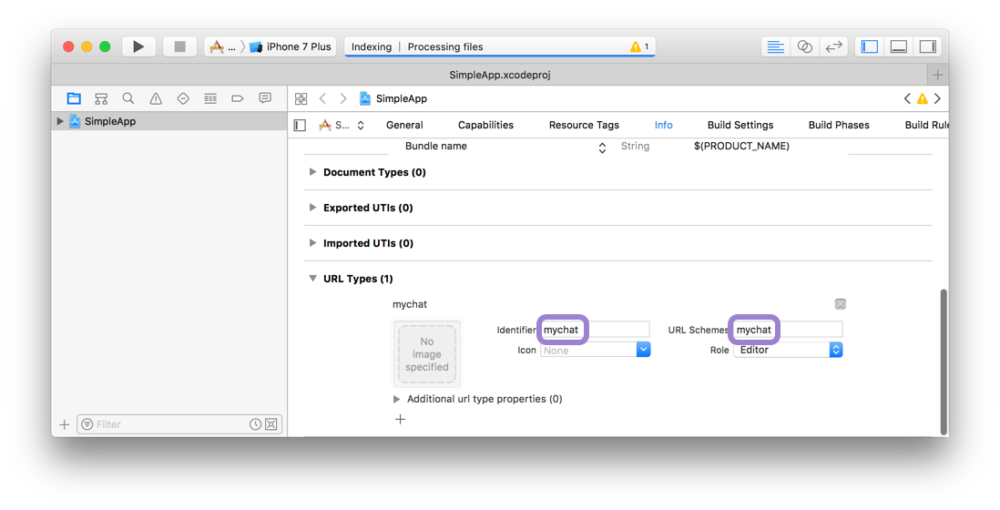

# DeepLink

0.5.0 版本开始支持 deep link.

## 注册

需要支持 deep link 的页面，在注册时需要传入第三个参数

```javascript
ReactRegistry.registerComponent('TopBarAlpha', () => TopBarAlpha, {
  path: 'topBarAlpha/:alpha/:color',
  dependency: 'TopBarMisc',
  mode: 'modal',
});
```

这个参数是个对象，一共有三个可选项

path 表示路径，其中冒号开头的片段表示参数，这些参数将会通过 props 传递给目标页面。

dependency 表示前置页面，譬如一个详情页可能会依赖一个列表页，当点击返回按钮时，会回到列表页。这个选项可以确定依赖链。看 playground 中的例子：

```javascript
ReactRegistry.registerComponent('Options', () => Options);
ReactRegistry.registerComponent('TopBarMisc', () => TopBarMisc, { dependency: 'Options' });
ReactRegistry.registerComponent('TopBarAlpha', () => TopBarAlpha, {
  path: 'topBarAlpha/:alpha/:color',
  dependency: 'TopBarMisc',
});
```

TopBarAlpha 依赖 TopBarMisc, TopBarMisc 依赖 Options, 当我们通过 `hbd://topBarAlpha/0.7/#FFFFFF` 这样的 url 打开 TopBarAlpha 这个页面时，会检查 app 当前的路由图，以决定是否切换到 tab Options, 在打开 TopBarAlpha 之前是否需要创建 TopBarMisc。

mode 表示显示模式，不设置在跳转时使用 push，设置为 modal 时使用 present。譬如 playground 项目中，Result 这个页面就是以 modal 的形式打开的。

## 激活

我们需要在一个稳定的页面（通常是主页面）激活路由功能。

譬如 playground 项目，在 Navigation.js 激活了路由功能

```javascript
import { router } from 'react-native-navigation-hybrid';

componentDidMount() {
  // on Android, the URI prefix typically contains a host in addition to scheme
  const prefix = Platform.OS == 'android' ? 'hbd://hbd/' : 'hbd://';
  router.activate(prefix);
}

componentWillUnmount() {
  router.inactivate();
}
```

## 拦截

有时我们需要拦截默认的跳转行为

router 对象为我们提供了注册和移除拦截器的一对方法

```javascript
registerInterceptor(func);
unregisterInterceptor(func);
```

func 是一个接收 path 为参数，返回 boolen 的函数，返回 true 表示拦截。

可以通过 `router.pathToRoute(path)` 来获取路由信息

## iOS 配置

Let's configure the native iOS app to open based on the mychat:// URI scheme.

In SimpleApp/ios/SimpleApp/AppDelegate.m:

```objc
// Add the header at the top of the file:
#import <React/RCTLinkingManager.h>

// Add this above the `@end`:
- (BOOL)application:(UIApplication *)application openURL:(NSURL *)url
  sourceApplication:(NSString *)sourceApplication annotation:(id)annotation
{
  return [RCTLinkingManager application:application openURL:url
                      sourceApplication:sourceApplication annotation:annotation];
}
```

In Xcode, open the project at SimpleApp/ios/SimpleApp.xcodeproj. Select the project in sidebar and navigate to the info tab. Scroll down to "URL Types" and add one. In the new URL type, set the identifier and the url scheme to your desired url scheme.



## Android 配置

To configure the external linking in Android, you can create a new intent in the manifest.

In SimpleApp/android/app/src/main/AndroidManifest.xml, add the new intent-filter inside the MainActivity entry with a VIEW type action:

```xml
<intent-filter>
    <action android:name="android.intent.action.VIEW" />
    <category android:name="android.intent.category.DEFAULT" />
    <category android:name="android.intent.category.BROWSABLE" />
    <data android:scheme="mychat" android:host="mychat" />
</intent-filter>
```

## 测试

具体可以参考 playground 这个项目中相关配置

可以在终端中通过以下两个命令分别测试 iOS 和 Android 的效果

iOS:

```
xcrun simctl openurl booted hbd://topBarAlpha/1/#333333
```

Android:

```
adb shell am start -W -a android.intent.action.VIEW -d "hbd://hbd/topBarAlpha/0.5/#FFFFF" com.navigationhybrid.playground
```
