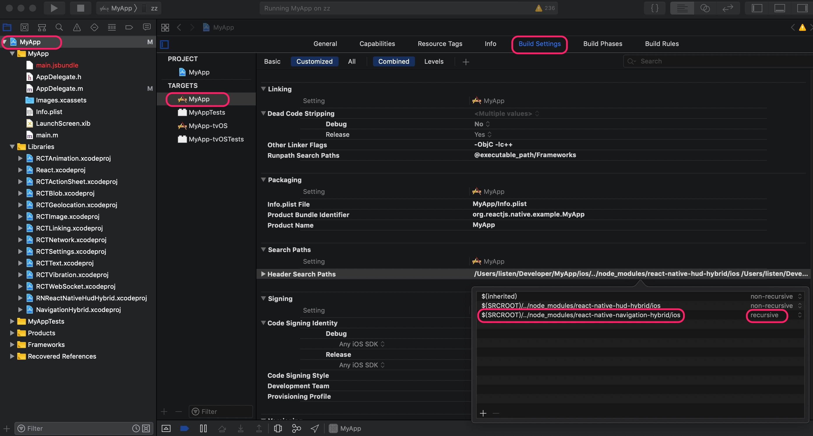

# 集成到以 RN 为主的项目

你想用 React Native 实现大部分业务，原生代码主要起到搭桥的作用。

可以参考 [iReading Fork](https://github.com/listenzz/reading) 这个项目。

假设你是通过 `react-native init AwesomeProject` 创建的项目，目录结构是这样的：

```
AwesomeProject/
|—— android/
|—— ios/
|—— node_modules/
|—— package.json
```

## 添加依赖

```
npm install react-native-navigation-hybrid --save
```

## Link

```
$ react-native link react-native-navigation-hybrid
```

## RN 项目配置

打开 index.js 这个文件，通常，它就在 package.json 旁边。

以前，你是这么注册 React 组件

```javascript
AppRegistry.registerComponent('ReactNativeProject', () => App);
```

现在，你需要像下面那样

```javascript
import { ReactRegistry, Garden, Navigator } from 'react-native-navigation-hybrid';
import Home from './HomeComponent';
import Profile from './ProfileComponent';

// 配置全局样式
Garden.setStyle({
  topBarStyle: 'dark-content',
});

// 重要必须
ReactRegistry.startRegisterComponent();

// 注意，你的每一个页面都需要注册
ReactRegistry.registerComponent('Home', () => Home);
ReactRegistry.registerComponent('Profile', () => Profile);

// 重要必须
ReactRegistry.endRegisterComponent();
```

设置入口页面布局

```javascript
Navigator.setRoot({
  drawer: [
    {
      tabs: [
        {
          stack: {
            screen: { moduleName: 'Navigation' },
          },
        },
        {
          stack: {
            screen: { moduleName: 'Options' },
          },
        },
      ],
    },
    {
      screen: { moduleName: 'Menu' },
    },
  ],
  options: {
    maxDrawerWidth: 280,
    minDrawerMargin: 64,
  },
});
```

根布局一共有四种类型的布局: screen, stack, tabs 以及 drawer

screen 对象有三个属性，分别是 moduleName, props, options，其中 moduleName 是必须的，它就是我们上面注册的那些模块名，props 是我们要传递给该页面的初始属性，options 是 navigationItem，参看[静态配置页面](./style.md#static-options)。

stack 对象包含一个其它布局对象作为根页面，通常是 screen.

tabs 对象是一个数组，成员是一个包含其它布局对象的对象

drawer 对象也是一个数组，长度固定为 2 ，第一个对象是抽屉的内容，第二个对象是抽屉的侧边栏。

可以在表示侧边栏的对象中添加 options 属性来配置侧边栏的宽度

`maxDrawerWidth` 表示侧边栏的最大宽度，`minDrawerMargin` 表示侧边栏距屏幕边缘的最小空隙，这两个属性可以单独使用，也可以一起指定。

可以先通过 `Navigator.setRoot` 设置一个入口页面，然后根据应用状态再次调用 `Navigator.setRoot` 决定要进入哪个页面。

> Navigator.setRoot 还接受第二个参数，是个 boolean，用来决定 Android 按返回键退出 app 后，再次打开时，是否恢复到首次将该参数设置为 true 时的那个 layout。通常用来决定按返回键退出 app 后重新打开时，要不要走闪屏逻辑。请参考 [iReading Fork](https://github.com/listenzz/reading) 这个项目对 Navigator.setRoot 的使用

### 支持 Redux

想要为每个页面都注入相同的属性，可以利用 `ReactRegistry.startRegisterComponent()` 这个方法，它接受一个函数作为参数，该函数的参数是一个返回我们将要构建的组件的函数，返回值是一个新的组件。

想要支持 Redux，像下面这样配置即可

```jsx
function screenWrapper(screenProvider) {
  const Screen = screenProvider();
  return props => (
    <Provider store={store}>
      <Screen {...props} />
    </Provider>
  );
}

ReactRegistry.startRegisterComponent(screenWrapper);
```

## Android 项目配置

假设你已经配置好了 React 项目

修改 android/build.gradle 文件

```diff
buildscript {
    repositories {
        jcenter()
+       google()
    }
    dependencies {
-        classpath 'com.android.tools.build:gradle:2.2.3'
+        classpath 'com.android.tools.build:gradle:3.1.1'
    }
}

allprojects {
    repositories {
        mavenLocal()
        jcenter()
        maven {
        // All of React Native (JS, Obj-C sources, Android binaries) is installed from npm
        url "$rootDir/../node_modules/react-native/android"
        }
+       google()
    }
}

+   ext {
+       minSdkVersion = 16
+       targetSdkVersion = 27
+       compileSdkVersion = 27
+       buildToolsVersion = '27.0.3'
+       // 必须保证支持包的版本 >= 27.1.1
+       supportLibraryVersion = '27.1.1'
+   }
```

修改 android/app/build.gradle 文件

```diff
android {
-   compileSdkVersion 23
-   buildToolsVersion "23.0.1"
+   compileSdkVersion rootProject.ext.compileSdkVersion
+   buildToolsVersion rootProject.ext.buildToolsVersion

    defaultConfig {
-       minSdkVersion 16
-       targetSdkVersion 22
+       minSdkVersion rootProject.ext.minSdkVersion
+       targetSdkVersion rootProject.ext.targetSdkVersion
    }
}

dependencies {  
+   compile project(':react-native-navigation-hybrid')
    compile fileTree(dir: "libs", include: ["*.jar"])
-   compile "com.android.support:appcompat-v7:23.0.1"
+   compile "com.android.support:appcompat-v7:$rootProject.supportLibraryVersion"
    compile "com.facebook.react:react-native:+" // From node_modules

+   configurations.all {
+       resolutionStrategy.eachDependency { DependencyResolveDetails details ->
+           def requested = details.requested
+               if (requested.group == 'com.android.support') {
+                   if (!requested.name.startsWith("multidex")) {
+                       details.useVersion rootProject.supportLibraryVersion
+                   }
+               }
+           }
+       }
    }
```

修改 android/gradle/wrapper/gradle-wrapper.properties 文件

```diff
- distributionUrl=https\://services.gradle.org/distributions/gradle-2.14.1-all.zip
+ distributionUrl=https\://services.gradle.org/distributions/gradle-4.4-all.zip
```

修改 MainActivity.java 文件

```diff
- import com.facebook.react.ReactActivity;
+ import com.navigationhybrid.ReactAppCompatActivity;

- public class MainActivity extends ReactActivity {
+ public class MainActivity extends ReactAppCompatActivity {
-   @Override
-   protected String getMainComponentName() {
-       return "AwesomeProject";
-   }
}
```

修改 MainApplication.java 文件

```diff
+ import com.navigationhybrid.ReactBridgeManager;
+ import com.navigationhybrid.HybridReactNativeHost;

- private final ReactNativeHost mReactNativeHost = new ReactNativeHost(this) {
+ private final ReactNativeHost mReactNativeHost = new HybridReactNativeHost(this) {

}

public void onCreate() {
    super.onCreate();
    SoLoader.init(this, /* native exopackage */ false);

+   ReactBridgeManager bridgeManager = ReactBridgeManager.get();
+   bridgeManager.install(getReactNativeHost());
}
```

> 注意：ReactNativeHost 的实例是 HybridReactNativeHost 对象，它为 reload bundle 做了些优化。

### 同步构建版本

查看 [这里](./sync-build-version.md)

## iOS 项目配置

修改 Header Search Paths



如图，删掉后面的 NavigationHybrid, 配置成如下的样子：

```bash
$(SRCROOT)/../node_modules/react-native-navigation-hybrid/ios
```

修改 AppDelegate.m 文件

```objc
#import "AppDelegate.h"
#import <React/RCTBundleURLProvider.h>
#import <NavigationHybrid/NavigationHybrid.h>

@implementation AppDelegate
- (BOOL)application:(UIApplication *)application didFinishLaunchingWithOptions:(NSDictionary *)launchOptions
{
    NSURL *jsCodeLocation;
    jsCodeLocation = [[RCTBundleURLProvider sharedSettings] jsBundleURLForBundleRoot:@"index" fallbackResource:nil];
    [[HBDReactBridgeManager sharedInstance] installWithBundleURL:jsCodeLocation launchOptions:launchOptions];

    self.window = [[UIWindow alloc] initWithFrame:[UIScreen mainScreen].bounds];
    self.window.backgroundColor = UIColor.whiteColor;
    UIViewController *rootViewController = [UIViewController new];
    self.window.rootViewController = rootViewController;
    [self.window makeKeyAndVisible];
    return YES;
}
@end
```

修改 Info.plist 文件


## 关于闪屏

<a name="migrate-native"></a>

可以像 playgroud 这个 demo 那样设置闪屏，也可以使用 react-native-splash-screen 设置闪屏
